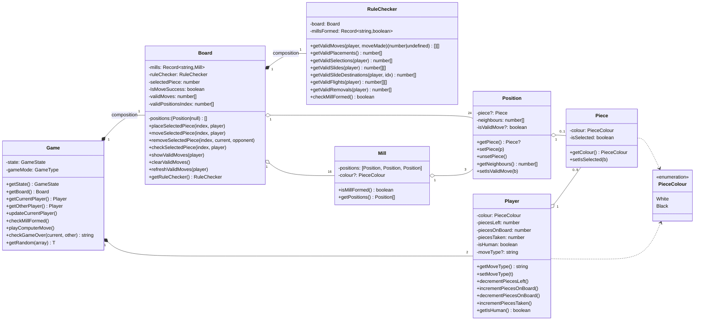
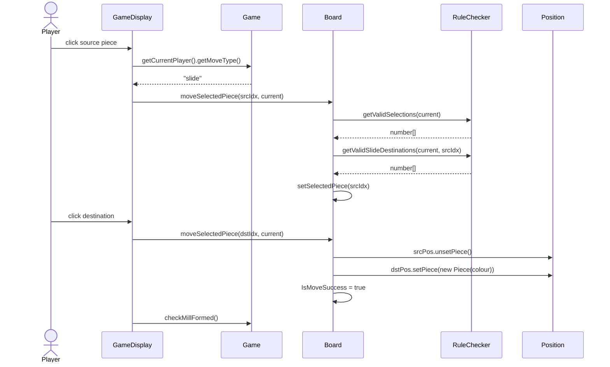
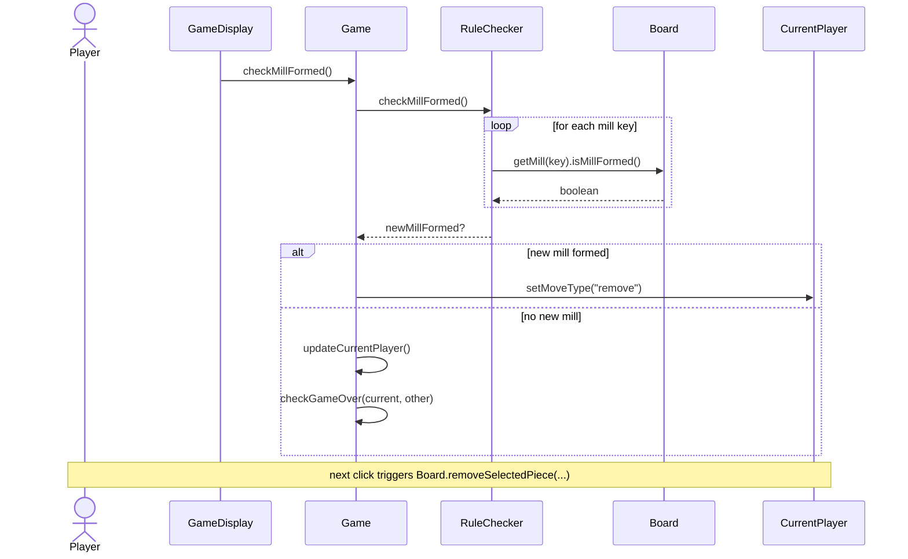

# Architecture

## Stack

- **Language:** TypeScript
- **UI framework:** React
- **Build tool:** Vite
- **Styling:** Tailwind CSS
- **Icons:** `react-icons`

The app is a single-page application that runs entirely in the browser with no backend. A single-player mode is supported in which the computer plays a uniformly-random legal move.

## High-level structure

```
src/
  models/       game core (mutable OOP)
  components/   React UI
  utils/        small helpers
  assets/       board image
  App.tsx       app shell
  main.tsx      Vite entry
```

`GameDisplay` holds a `Game` instance in `useState`, calls mutating methods on `game.getBoard()` in response to clicks, and triggers a re-render by constructing a new `Game` from the same `GameState`.

## Class diagram



## Class responsibilities

### `Game`

Top-level coordinator. Holds the two `Player`s, the `Board`, the current player, and game-over state. Drives turn handover, mill detection, game-over checks, and — when the second player is the computer — invokes `playComputerMove`.

`playComputerMove` reads the current player's `moveType` (one of `"place" | "slide" | "fly" | "remove"`) and picks uniformly at random from `RuleChecker`'s valid-move arrays.

### `Board`

Owns the array of `Position`s, the dictionary of `Mill`s, the `RuleChecker`, and selection / highlight state (`selectedPiece` index, `IsMoveSuccess` flag, cached `validMoves`). Exposes the action methods the UI calls — `placeSelectedPiece`, `moveSelectedPiece`, `removeSelectedPiece` — each of which mutates position contents in place.

The board uses a 49-cell sparse layout to make rendering math match the 7×7 visual grid: `positions` is `Array(49)` with only 24 slots populated. The 24 valid indices, their neighbours, and the 16 mill triples are hardcoded in the constructor.

### `RuleChecker`

Computes legal moves for the current player. Tracks a `millsFormed` map across turns to detect *new* mills — mill formation is what triggers the remove-piece phase, not just the existence of a mill on the board.

### `Player`

Per-player state: colour, piece counts (`piecesLeft`, `piecesOnBoard`, `piecesTaken`), whether human or computer, and an optional explicit `moveType` override. `getMoveType()` derives the type from piece counts (`piecesLeft > 0` → `"place"`; `piecesOnBoard <= 3` → `"fly"`; otherwise `"slide"`), which lets `Game` set it to `"remove"` after a mill is formed.

### `Position`

A single board intersection: which `Piece` (if any) is on it, the indices of adjacent positions, and an `isValidMove` flag used for highlighting during a player's turn.

### `Mill`

A triple of positions that *can* form a mill. `isMillFormed()` returns true when all three positions hold pieces of the same colour.

### `Piece`

A token: colour, plus an `isSelected` flag.

## Sequence diagrams

### Sliding a piece



### Forming a mill (and removing a piece)



## UI components

```
components/
  GameDisplay.tsx     game shell, owns the Game instance, dispatches clicks
  Board.tsx           renders the 7x7 grid + board image
  Position.tsx        one intersection (click handler + valid-move highlight)
  Piece.tsx           one token (colour + W/B letter + selection state)
  Mill.tsx            visual line drawn through a formed mill
  PiecesLeft.tsx      side panel showing per-player piece counts
  ChooseGameMode.tsx  Human vs. Computer mode picker (start screen)
  GameOverModal.tsx   end-of-game popup with winner + new-game button
  ErrorAlert.tsx      transient error banner for invalid actions
```
