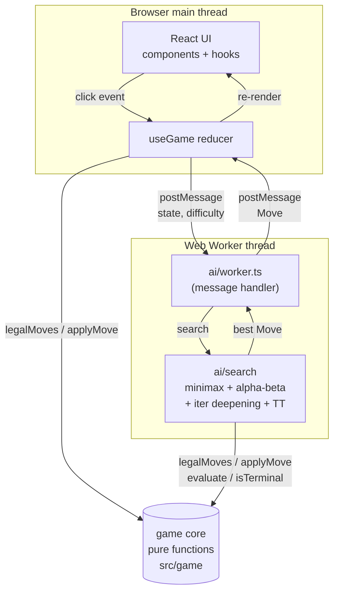
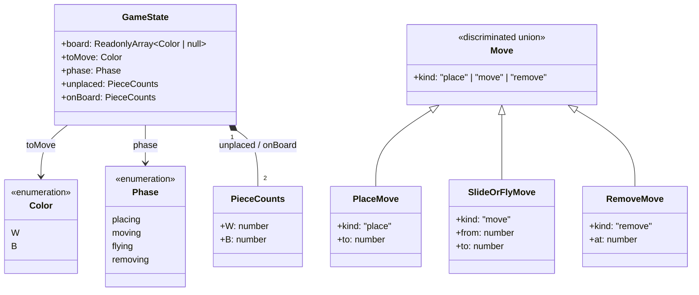
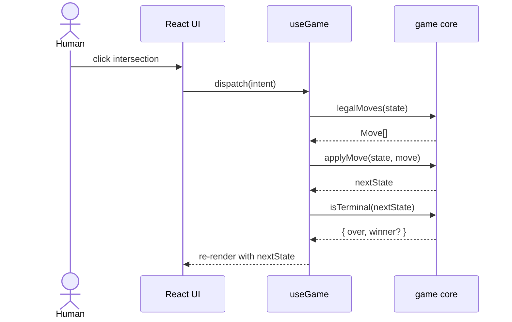
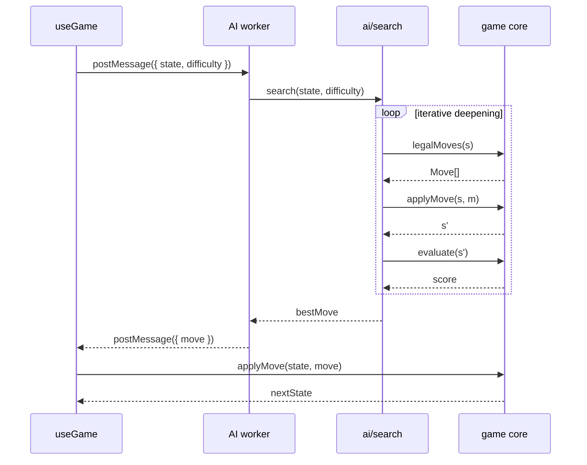

# Architecture

## Stack

- **Language:** TypeScript
- **UI framework:** React
- **Build tool:** Vite
- **Styling:** Tailwind CSS
- **Components:** shadcn/ui
- **Icons:** lucide-react
- **Lint / format:** ESLint (flat config) + `@typescript-eslint`, Prettier
- **Tests:** Vitest + `@testing-library/react` + `jsdom`
- **Package manager:** npm
- **Path aliases:** `@/*` → `src/*`

The app is a single-page application that runs entirely in the browser with no backend. The AI runs in a Web Worker so the UI stays responsive while it searches.

## High-level structure

```
src/
  game/          pure functional game core (state, moves, rules)
  ai/            search engine + Web Worker entry
  components/    React UI consuming GameState
  hooks/         React hooks (useGame, useAi, ...)
  lib/           UI helpers, shadcn utilities
  assets/        app icon, other assets
  App.tsx        app shell
  main.tsx       Vite entry
```

The game core is pure data and pure functions. UI selection / highlight state lives in React, not in the model. The AI consumes the same `GameState` and produces a `Move` to be applied via `applyMove`.



## Game core

The core is a small set of immutable types and pure functions in `src/game/`.

```ts
type Color = "W" | "B";
type Phase = "placing" | "moving" | "flying" | "removing";

type GameState = {
  board: ReadonlyArray<Color | null>; // length 24
  toMove: Color;
  phase: Phase;
  unplaced: { W: number; B: number };
  onBoard:  { W: number; B: number };
};

type Move =
  | { kind: "place";  to: number }
  | { kind: "move";   from: number; to: number } // covers slide and fly
  | { kind: "remove"; at: number };

function initialState(): GameState;
function legalMoves(state: GameState): Move[];
function applyMove(state: GameState, move: Move): GameState; // returns a new state
function isTerminal(state: GameState): { over: boolean; winner?: Color };
function evaluate(state: GameState): number; // heuristic for the AI
```

The same data model rendered as a type diagram:



Key properties:

- **24-cell board.** `board` is a length-24 `ReadonlyArray`. The 24 adjacency lists and the 16 mill triples are static tables in `src/game/board.ts`.
- **Immutable state.** `applyMove` returns a fresh `GameState`; nothing is mutated. The search just keeps state references on the stack — no undo logic needed.
- **Removing is a phase, not a side effect.** When a move forms a new mill, `applyMove` transitions `phase` to `"removing"` for the same player. Move generation stays uniform: `legalMoves` returns the set of legal removals next.
- **New mill detection is derived.** "Did this move form a new mill?" is computed from the before/after board, by checking whether the destination square is now part of a mill triple that wasn't full of the moving colour beforehand. No persistent `millsFormed` map.

## AI engine

`src/ai/` implements a classical chess-style search.

- **Algorithm:** minimax with alpha-beta pruning, driven by iterative deepening to a time budget.
- **Transposition table:** Zobrist-hashed `(board, toMove, phase, unplaced)` keys with depth + best-move + score-bound entries. Reused across iterations for move ordering.
- **Move ordering:** mill-forming moves first, then mill-breaking-then-reforming setups, then captures (`"remove"` moves), then the rest. Cuts the tree aggressively in mill-heavy positions.
- **Evaluation features** (weighted sum, weights tuned per phase):
  - material difference (pieces on board + unplaced)
  - number of own mills
  - number of "two-in-a-row that can be closed next turn"
  - mobility (legal move count)
  - blocked opponent pieces

Difficulty levels:

- **Easy:** depth-2 search with an occasional ε-random move.
- **Medium:** depth-4 search.
- **Hard:** iterative deepening within a time budget (~500 ms).

## Web Worker

The AI lives in `src/ai/worker.ts` and runs in a dedicated Web Worker spawned by Vite's worker bundling. The contract is small:

```ts
type AiRequest  = { state: GameState; difficulty: "easy" | "medium" | "hard" };
type AiResponse = { move: Move };
```

The UI posts an `AiRequest` when it's the computer's turn and applies the returned `Move` via `applyMove`. The worker imports the same `src/game/` modules as the UI thread, so the rules are guaranteed to match.

## Sequence diagrams

### Human plays a move



### Computer plays a move



## UI components

```
components/
  GameDisplay.tsx     game shell, owns state + dispatch
  Board.tsx           draws the three-square board and 24 intersections
  Position.tsx        one intersection (click handler + valid-move highlight)
  Piece.tsx           one token (plain coloured circle)
  Mill.tsx            visual line drawn through a formed mill
  PiecesLeft.tsx      side panel showing per-player piece counts
  StatusPanel.tsx     whose turn + current phase + AI thinking indicator
  DifficultyPicker.tsx  Easy / Medium / Hard selector
  ChooseGameMode.tsx  Human vs. Human vs. Human vs. Computer
  GameOverModal.tsx   end-of-game popup with winner + new-game button
  ErrorAlert.tsx      transient error banner for invalid actions
  MoveHistory.tsx     scrollable list of moves played this game
```

UI selection state (which piece is currently picked up, which destinations are highlighted) lives in React component state / a local reducer, not in `GameState`.

## Deployment

Static site, deployed to Vercel. There is no server-side code: the bundle (HTML, JS, CSS, assets, worker) is uploaded as-is and served from the CDN. AI performance is identical regardless of host because all compute happens in the user's browser.
